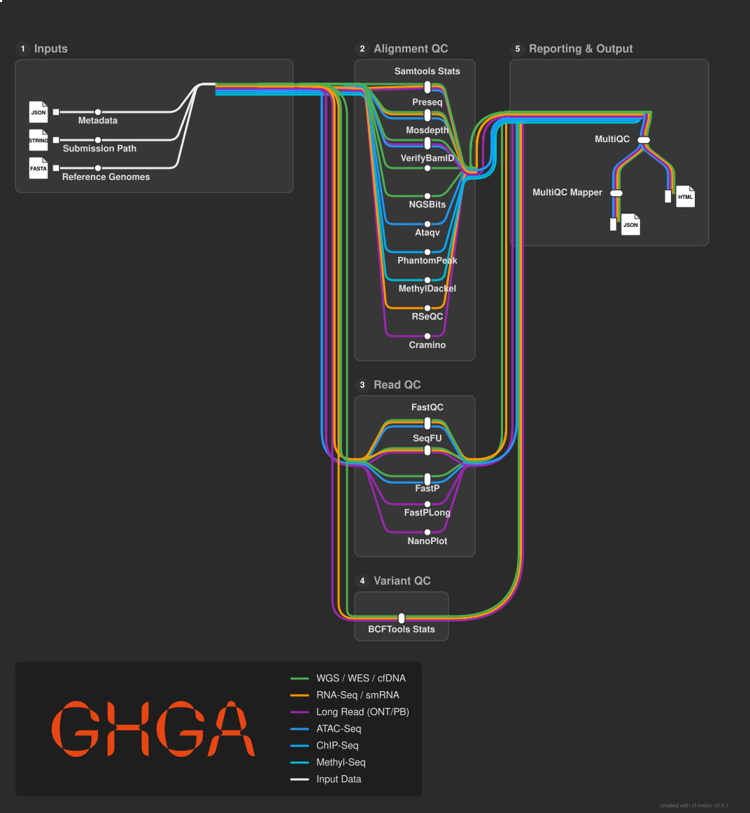

# GHGA AQuA Nextflow Pipeline

[](https://github.com/ghga-de/aqua/actions/workflows/nf-test.yml)
[](https://github.com/GHGA/qc/actions/workflows/linting.yml)
[](https://www.nf-test.com)

[](https://www.nextflow.io/)
[](https://docs.conda.io/en/latest/)
[](https://www.docker.com/)
[](https://sylabs.io/docs/)

<p align="center">
    
</p>

## Introduction

**GHGA AQuA (Automatic Quality Assessment) Pipeline** is a bioinformatics pipeline that performs basic quality control over input datasets without altering the raw data. It accepts three main input types:

1. Raw FastQ files
2. Aligned BAM/CRAM files
3. Variant called VCF/BCF files

By default the pipeline is streamlined to strictly run a minimal set of tools. This ensures rapid generation of the essential metrics required to fulfill the GHGA metadata requirements. It is designed to take a GHGA formatted JSON metadata file and generate a single compiled TSV file containing these precise metrics.

Users who need a more comprehensive analysis can still access the full suite of available quality control tools. By using the `--analysis_tools` parameter you can populate the pipeline with specialized tools and generate a rich MultiQC report for detailed visual exploration.

<picture>
  <source media="(prefers-color-scheme: dark)" srcset="docs/images/metromap.svg">
  
</picture>

## Tool & Analysis Matrix

## Default GHGA Quality Control Metrics

When run in its default state the pipeline outputs a unified TSV file containing the specific metrics listed below. The exact tool used depends on the data format and the analysis type provided.

| Data Type | Analysis Types | Tool | QC Metrics |
| :--- | :--- | :--- | :--- |
| **Raw (FASTQ.GZ)** | WGS, WES, WXS, RNA, ATAC, METHYLATION, CHIP | FASTP | total_reads, q20_rate, gc_content |
| **Raw (FASTQ.GZ)** | PACBIO, NANOPORE | FASTPLONG | total_reads, q20_rate, gc_content |
| **Processed (BAM, CRAM)** | ALL | MOSDEPTH | mean_coverage |
| **Processed (BAM, CRAM)** | ALL | SAMTOOLS STATS | reads_mapped, reads_duplicated |
| **Other (VCF, BCF)** | ALL | BCFTOOLS STATS | number_of_samples, number_of_records |

### Metric Definitions

*   **total_reads**: The total count of sequences present in the file. (Integer)
*   **q20_rate**: The fraction of bases achieving a quality score of 20 or above after filtration. (Float)
*   **gc_content**: The proportion of bases that are guanine or cytosine. (Float)
*   **mean_coverage**: The average number of times each base in the reference genome is sequenced. (Float)
*   **reads_mapped**: The total number of reads that successfully aligned to the reference sequence. (Integer)
*   **reads_duplicated**: The total number of reads marked as identical optical or polymerase chain reaction duplicates. (Integer)
*   **number_of_samples**: The total count of distinct biological samples present in the file. (Integer)
*   **number_of_records**: The total count of variant lines contained in the file. (Integer)

## Extended Tool and Analysis Matrix

For advanced users the following table details the extended tools available for different analysis methods. Tools in _Italic_ represent the default paths but you can customize the execution by adding tools with `--analysis_tools` or removing defaults with `--skip_tools`.

| Analysis Method     | Read QC (FastQ)                | Alignment QC (BAM)                                                               | Variant QC (VCF) |
| :------------------ | :----------------------------- | :------------------------------------------------------------------------------- | :--------------- |
| **WGS**             | _FastP_, FastQC, SeqFU         | _Mosdepth_, Sambamba flagstats, _Samtools Stats_, VerifyBamID, NGSBits, Preseq | _BCFTools Stats_ |
| **WES / TES**       | _FastP_, FastQC, SeqFU         | _Mosdepth_, Sambamba flagstats, _Samtools Stats_, Preseq                         | _BCFTools Stats_ |
| **ATAC Seq**        | _FastP_, FastQC, SeqFU         | _Mosdepth_, Sambamba flagstats, Ataqv, _Samtools Stats_, Preseq                |                  |
| **ChIP Seq**        | _FastP_, FastQC, SeqFU         | _Mosdepth_, Sambamba flagstats, Phantompeakqualtools, _Samtools Stats_, Preseq |                  |
| **RNA Seq / smRNA** | FastQC, SeqFU                  | _Samtools Stats_, RSeQC, Preseq                                                | _BCFTools Stats_ |
| **Nanopore**        | _FastPLong_, _NanoPlot_, SeqFU | _Mosdepth_, Sambamba flagstats, Cramino, _Samtools Stats_                      | _BCFTools Stats_ |
| **PacBio**          | _FastPLong_, _NanoPlot_        | _Mosdepth_, Cramino, Sambamba flagstats, _Samtools Stats_                      | _BCFTools Stats_ |
| **MethylSeq**       | _FastP_, FastQC, SeqFU         | _Mosdepth_, MethylDackel, Sambamba flagstats, _Samtools Stats_                   |                  |
| **cfDNA / Other**   | _FastP_, FastQC, SeqFU         | _Mosdepth_, Sambamba flagstats, _Samtools Stats_                                 | _BCFTools Stats_ |

> [!NOTE]
> Tools in _Italic_ are used as default, yet user can add tools to the analysis uisng --analysis_tools or remove default using --skip_tools. 

## Usage

The pipeline can be started in two ways: by providing a manual samplesheet or by providing GHGA-compliant metadata.

### Option A: Manual Samplesheet (CSV)

Create a samplesheet.csv with your data. The pipeline auto-detects the starting step based on which columns are populated.

You must create a `samplesheet.csv` containing your input data. The structure requires a `step` column to tell the pipeline which type of file you are providing:

- **step 1**: FastQ files (Read QC)
- **step 2**: BAM/CRAM files (Alignment QC)
- **step 3**: VCF files (Variant QC)

A samplesheet containing a mix of raw data, mapped bams, and variant files would look like this:

```csv title="samplesheet.csv"
sample,lane,individual_id,sex,experiment_method,fastq_1,fastq_2,bam,bai,vcf
SAMPLE_FASTQ,L001,ind_1,MALE,wgs,s1_R1.fastq.gz,s1_R2.fastq.gz,,,
SAMPLE_BAM,L001,ind_2,FEMALE,wgs,,,s2.bam,s2.bam.bai,
SAMPLE_VCF,L001,ind_3,NA,wgs,,,,,s3.vcf.gz
```

| Column                | Description                                                                                                                                                                        |
| :-------------------- | :--------------------------------------------------------------------------------------------------------------------------------------------------------------------------------- |
| `sample`              | **Required.** Custom sample name. This identifier is used to group multiple sequencing runs (lanes) from the same sample. Spaces are automatically converted to underscores (`_`). |
| `lane`                | **Required.** identifier for the sequencing lane or library (e.g., L001, L002). Must not contain spaces.                                                                           |
| `individual_id`       | Identifier for the individual (patient/subject).                                                                                                                                   |
| `sex`                 | Biological sex of the individual (e.g., MALE, FEMALE, NA).                                                                                                                         |
| `status`              | Disease status as an integer: `0` (Normal/Control) or `1` (Tumor/Case).                                                                                                            |
| `phenotype`           | Phenotypic terms or descriptions associated with the individual.                                                                                                                   |
| `sample_type`         | The type of sample (e.g., GENOMIC_DNA, TOTAL_RNA).                                                                                                                                 |
| `disease_status`      | Text description of the disease status (e.g., Healthy, Tumor).                                                                                                                     |
| `case_control_status` | Status in the study design (e.g., CASE, CONTROL).                                                                                                                                  |
| `tissue`              | The source tissue of the specimen (e.g., blood, tissue).                                                                                                                           |
| `experiment_method`   | The sequencing method used. Supported values: `wgs`, `wes`, `rna`, `atac`, `nanopore`, `pacbio`.                                                                                   |
| `analysis_method`     | The type of analysis performed (e.g., `varcall`).                                                                                                                                  |
| `fastq_1`             | Path to the Read 1 FastQ file. Must end in `.fastq.gz` or `.fq.gz`.                                                                                                                |
| `fastq_2`             | Path to the Read 2 FastQ file for paired-end data. Optional for single-end.                                                                                                        |
| `single_end`          | Boolean (`true`/`false`) indicating if the sequencing is single-end.                                                                                                               |
| `bam`                 | Path to the aligned BAM file.                                                                                                                                                      |
| `bai`                 | Path to the corresponding BAM index file.                                                                                                                                          |
| `cram`                | Path to the aligned CRAM file.                                                                                                                                                     |
| `crai`                | Path to the corresponding CRAM index file.                                                                                                                                         |
| `vcf`                 | Path to the Variant Call Format file. Must end in `.vcf` or `.vcf.gz`.                                                                                                             |
| `data_files`          | Semicolon-separated list of any other relevant data files not covered by specific columns.                                                                                         |

An [example samplesheet](../tests/samplesheets/samplesheet.csv) has been provided with the pipeline.

### Option B: GHGA Metadata (JSON)

If you already have a metadata.json following the GHGA metadata model, you can provide it directly. The pipeline will automatically convert the JSON into the required internal format, eliminating the need to create a manual samplesheet.

### 2. Run the Pipeline

Run the pipeline using the command below with input samplesheet.csv.

```bash
nextflow run main.nf \
   -profile docker/singularity/conda \
   --input samplesheet.csv \
   --outdir ./results
```

or using the command below with input metadata.json.

```bash
nextflow run main.nf \
   -profile docker/singularity/conda \
   --metadata metadata.json \
   --outdir ./results
```

> [!WARNING]
> Please provide pipeline parameters via the CLI or Nextflow `-params-file` option. Custom config files including those provided by the `-c` Nextflow option can be used to provide any configuration _**except for parameters**_; see [docs](https://nf-co.re/docs/usage/getting_started/configuration#custom-configuration-files).

## Supported Tools

### Read QC

- [**FastQC**](https://www.bioinformatics.babraham.ac.uk/projects/fastqc/): Basic quality control checks for raw sequence data.
- [**FastP**](https://github.com/OpenGene/fastp): A fast processor used to generate read metrics for quality control.
- [**SeqFU**](https://telatin.github.io/seqfu2/): Tools for gathering sequence statistics and metadata.
- [**NanoPlot**](https://github.com/wdecoster/NanoPlot): Specialized plotting for long read sequencing data.
- [**FastPLong**](https://github.com/OpenGene/fastplong): Quality control specifically for PacBio and other long read data.

### Alignment QC

- [**Mosdepth**](https://github.com/brentp/mosdepth): Fast depth calculation for BAM or CRAM files using target intervals for specific assays.
- [**Sambamba Flagstats**](https://lomereiter.github.io/sambamba/docs/sambamba-flagstat.html): Comprehensive statistics for alignment files.
- [**Samtools Stats**](http://www.htslib.org/doc/samtools.html): Comprehensive statistics for alignment files.
- [**Ataqv**](https://github.com/ParkerLab/ataqv): Specialized quality control for ATAC sequencing experiments.
- [**Phantompeakqualtools**](https://github.com/kundajelab/phantompeakqualtools): Tools for quality control of ChIP sequencing datasets.
- [**RSeQC**](http://rseqc.sourceforge.net/): A quality control package designed for RNA sequencing experiments.
- [**Preseq**](https://github.com/smithlabcode/preseq): Software to estimate library complexity and duplication.
- [**VerifyBamID**](https://github.com/Griffan/VerifyBamID): Estimation of DNA contamination using ancestry agnostic methods.
- [**NGSBits SampleGender**](https://github.com/imgag/ngs-bits): Determination of biological sex based on sequencing coverage.
- [**Cramino**](https://github.com/wdecoster/cramino): Extremely fast quality control tool for long read alignment files.
- [**MethylDackel**](https://github.com/dpryan79/MethylDackel): Quality metric extractor for bisulfite converted methylation sequencing data.

### Variant QC

- [**BCFTools Stats**](http://samtools.github.io/bcftools/bcftools.html): Detailed statistics and metrics for VCF and BCF files.

### Reporting

- [**MultiQC**](http://multiqc.info/): A tool that combines all quality control results into one interactive report.
- [**MultiQC mapper**](https://github.com/MKoesters/multiqc-mapper): A tool unifies QC reports to report back to the GHGA dataportal.

## Credits

GHGA AQuA nextflow pipeline was originally written by Kubra Narci.

Current development team:

- Kubra Narci
- Manuel Kösters
- Virag Sharma
- Ruchi Tanavade

## Contributions and Support

If you would like to contribute to this pipeline, please see the contributing guidelines.

## Citations

An extensive list of references for the tools used by the pipeline can be found in the CITATIONS.md file. This pipeline uses code and infrastructure developed and maintained by the nf core community.

This pipeline uses code and infrastructure developed and maintained by the [nf-core](https://nf-co.re) community, reused here under the [MIT license](https://github.com/nf-core/tools/blob/main/LICENSE).

> **The nf-core framework for community-curated bioinformatics pipelines.**
>
> Philip Ewels, Alexander Peltzer, Sven Fillinger, Harshil Patel, Johannes Alneberg, Andreas Wilm, Maxime Ulysse Garcia, Paolo Di Tommaso & Sven Nahnsen.
>
> _Nat Biotechnol._ 2020 Feb 13. doi: [10.1038/s41587-020-0439-x](https://dx.doi.org/10.1038/s41587-020-0439-x).
